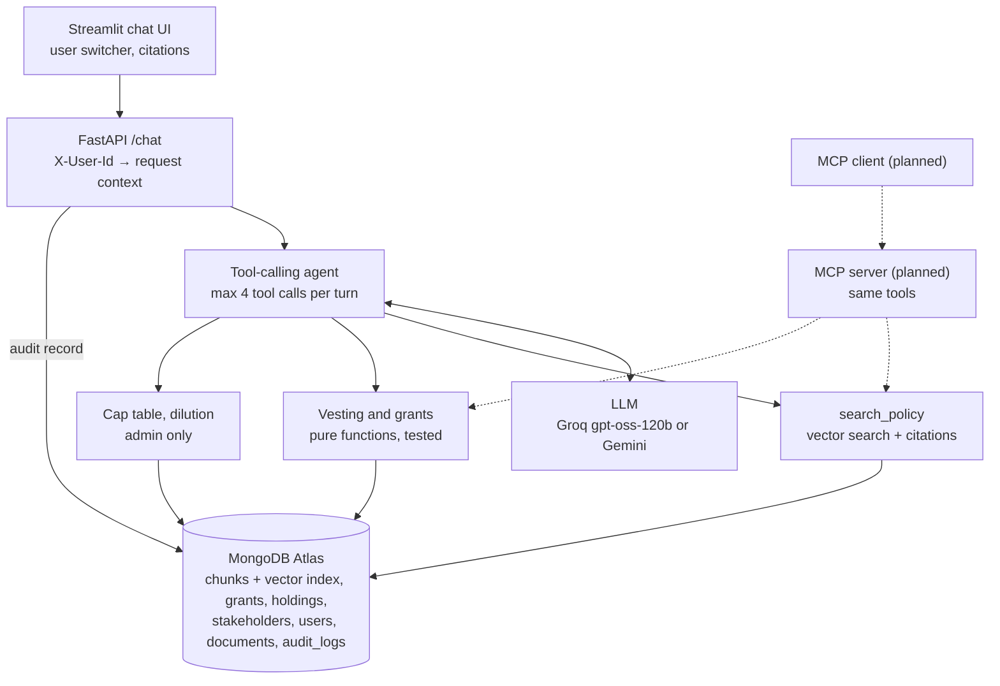

# Vestwise: RAG + tool-calling ESOP assistant

Vestwise answers employees' and admins' questions about stock options. **Every number comes from a tested function, every policy claim cites a page, and every user sees only their own data.**

## The problem

Employees ask HR the same questions about their stock options: *How many have I vested? What happens if I resign? How long do I have to exercise?* The answers live in two places: policy PDFs (rules) and the cap table (numbers). A general-purpose chatbot is the wrong tool for both:

- **Numbers must be exact.** LLMs are unreliable at date arithmetic and rounding, and an equity figure that's off by one month's vesting is a real problem.
- **Claims must be traceable.** "Your unvested options lapse" needs a citation a reviewer can check in seconds.
- **Data must be isolated.** An employee must never see a colleague's grant, however the question is phrased.

Vestwise splits the work: **deterministic tools** compute every number, **retrieval with page-level citations** answers policy questions, and an **LLM only decides which to use and phrases the result**.

## Demo

> _Demo GIF placeholder: `docs/demo.gif` (to be recorded: Priya asks the mixed question and sees the number, citations and tools used; asks for Rahul's grant and is refused; Arjun runs a dilution scenario)._

| As Priya (employee) | Answer |
| --- | --- |
| *If I leave next month, how many options do I keep and how long do I have to exercise them?* | 2,200 vested options (from `get_vesting_status(as_of=2026-11-03)`), 90 days after the last working day [ESOP Policy, p. 5, 6] |
| *Show me Rahul's grant.* | "I can only share information about your own grants." (no tool called, nothing retrieved) |

| As Arjun (admin) | Answer |
| --- | --- |
| *If we issue 2,000,000 new shares to Horizon Capital, how does my ownership change?* | Fully diluted 57.14% → 48.00% (from `simulate_dilution`) |

## Architecture



The API sets identity and writes the audit log. The LLM only chooses which tool to call and writes the answer. The tools are the only components that read cap table data.

**One request** (*"If I leave next month…"* as Priya):

1. The UI sends `POST /chat` with `X-User-Id: u_priya`.
2. The API loads her `company_id`, role and `stakeholder_id` from Mongo into a frozen request context.
3. The agent gets her three tools, each a closure over that context: `search_policy(query)`, `get_vesting_status(as_of)` and `get_grants()`.
4. The model calls `get_vesting_status(as_of="2026-11-03")` (2,200 vested) and `search_policy("exercise window after leaving, termination of employment")` (policy pp. 5–6).
5. It writes the answer from the tool outputs. Every in-text citation is checked against the pages actually retrieved.
6. The API writes an audit record and returns `{answer, outcome, citations, tool_calls, latency_ms}` with an `X-Audit-Id` header.

## Design decisions

| Decision | Why |
| --- | --- |
| **Deterministic tools for every number** | Vesting (`app/tools/vesting.py`) and dilution (`app/tools/captable.py`) are pure, unit-tested functions; the prompt forbids the LLM from calculating. Equity numbers must be exact and auditable, and a pure function can be tested for every edge case (cliff day, month-end grants, leavers). |
| **Tools scoped by closures, not parameters** | Tools are built per request as closures over the server-side context. An employee's `get_vesting_status` takes only `as_of`; there is no `stakeholder_id` parameter for a prompt injection to fill in. Admin-only tools simply don't exist in an employee's request. |
| **Document-level access in the vector filter** | Each chunk carries `company_id` and `owner_stakeholder_id` (null for company-wide documents). The access filter is applied *inside* `$vectorSearch` (a pre-filter), so another employee's grant letter is never a candidate, and the user still gets the best 5 chunks they're allowed to see. |
| **Citation validation** | Every in-text `[Title, p. N]` is checked against the pages retrieved in that turn. An invalid one triggers one corrective retry, then it is stripped and the turn is flagged `citation_invalid` in the audit log. Answers show only citations backed by retrieved text. |
| **Fail-closed audit log** | Every authenticated `/chat` writes a record: who, role, `as_of`, model, tool calls with arguments, retrieved chunk ids, answer, outcome, citation check, latency. If the audit write fails, the answer is not returned. |
| **Temperature 0** | A fixed constant for both providers, for repeatable tool choices and wording. It narrows variation but doesn't remove it (see Evaluation), which is why numbers come from tools and checks accept equivalent forms of the same figure. |
| Heading-aware chunks sized to the embedding model | Chunks split on clause headings, never span two pages (so a citation is exactly one page), and fit `all-MiniLM-L6-v2`'s 256-token window. |
| Identity only from a header | Request bodies have no identity fields (unknown fields are ignored). For the demo the header is trusted; in production it becomes a verified JWT and only one function changes. |

## Evaluation

All numbers below were measured on the synthetic company in `data/`, with `as_of` fixed per question.

| What | Result | How it was measured |
| --- | --- | --- |
| Retrieval hit@5 | **10/11** (91%; target ≥ 90%) | `scripts/eval_retrieval.py`: each policy and mixed golden question used as the query, as its own user; the expected page must be in the top 5. The one miss is explained below. |
| Isolation | **0 leaks** | Every golden question retrieved as Priya at k=5 and k=50 returns no chunk of Rahul's letter; the same probe as admin does return it (positive control). Plus 43 API access tests (401/403 matrix, spoofed identity in body). |
| Agent demo set | **10/10** in a single run (Groq `openai/gpt-oss-120b`) | `scripts/try_agent.py`: 3 success-criteria questions, the Rahul probes, dilution, the acquisition question and 3 not-in-documents questions, each with automatic checks. First-draft citation precision 6/6 in that run. |
| Unit and integration tests | **325 passed** | `pytest`; no test calls the LLM or the database (fakes plus a network tripwire). |
| Full golden-set eval (20 questions through the agent) | _pending_ | `scripts/eval.py`; see the note below. |

**Full golden-set eval: pending.** `scripts/eval.py` runs all 20 golden questions through the real agent and reports retrieval hit@5, number accuracy, refusal accuracy, citation rate, first-draft citation precision, retry rate, and latency with and without rate-limit waits. One full run uses ~110–135k tokens, and Groq's free tier allows 200k tokens per day for this model, so the two runs needed for a variance measurement are scheduled on separate days. Results will be added here with the run files in `eval/`.

**The one retrieval miss.** "What happens to my options if *Nimbus* gets acquired?" retrieved the acquisition clause only at rank 11: the company name dominates the query embedding. Through the agent this is fixed by query rewriting. The `search_policy` docstring tells the model to use the policy's vocabulary and drop the company name, so it searches "change of control acquisition" and cites p. 7.

## Known limitations

- **Free-tier latency.** On Groq's free tier, answers take 1–30 s, mostly waiting on per-minute token limits (each call sends ~2–3k tokens). Measured without throttling, a two-tool answer takes ~2.5 s, inside the 6 s target. The daily token limit also caps full evaluation runs at about one per day.
- **Citation checks verify retrieval, not entailment.** A citation is accepted if its page was retrieved in that turn; nothing yet checks that the page actually *supports* the sentence it's attached to.
- **Vesting model gaps.** Bad-leaver forfeiture, acceleration on acquisition, unpaid-leave suspension and the 10-year expiry are stated in the policy (and answered from it, with citations), but not modelled in the vesting calculation.
- **Simulated login.** The UI's user switcher sets `X-User-Id`; anyone who can reach the UI can pick the admin. Both servers bind to localhost only.
- **Synthetic data, one company.** The data model is multi-tenant (`company_id` everywhere), but the demo has one company and four documents.

## Setup and run

Requirements: Python 3.12, a MongoDB Atlas cluster (the free M0 tier works, with Atlas Vector Search), and a Groq or Gemini API key.

```bash
git clone <this repo> && cd vestwise
python3.12 -m venv .venv && source .venv/bin/activate
pip install -r requirements.txt
cp .env.example .env            # fill in MONGO_URI, LLM_PROVIDER, LLM_MODEL and the provider's API key

python scripts/build_pdfs.py            # synthetic policy, grant letters, board resolution
python scripts/seed.py                  # company, users, stakeholders, holdings, grants
python scripts/ingest_all.py            # chunk + embed the PDFs into Atlas
python scripts/create_vector_index.py   # Atlas Vector Search index (waits until READY)

python -m pytest -q                     # 325 tests, no network
bash scripts/run_all.sh                 # API on :8000/docs, UI on :8501; Ctrl+C stops both
```

Demo users: `u_priya` and `u_rahul` (employees), `u_arjun` (admin). Other scripts:

| Script | Purpose |
| --- | --- |
| `scripts/api_demo.sh` | The demo questions with curl, plus access checks and the last audit records |
| `scripts/try_agent.py` | 10 agent cases with pass/fail checks |
| `scripts/eval_retrieval.py` | Retrieval hit@5, score distribution, access assertion (no LLM) |
| `scripts/eval.py` | Full golden-set evaluation through the agent; `--compare` for run-to-run variance |

## Project layout

```text
app/
  main.py, schemas.py        FastAPI endpoints and models (identity from X-User-Id)
  context.py                 RequestContext, loaded server-side
  agent.py                   tool-calling loop, citation validation, answer normalisation
  audit.py                   audit records
  llm.py, config.py, db.py   provider switch (temperature 0), settings, Mongo handles
  ingest/                    PDF loader, heading-aware chunker, embedder, pipeline
  rag/                       access filter, retriever, system prompt
  tools/                     vesting, cap table/dilution (pure), repo, per-request tool factory
ui/                          Streamlit app and its HTTP client
scripts/                     data build, seed, ingest, index, demos, evals
eval/golden.jsonl            20 golden questions
tests/                       pytest suite
```

## What's next

- **Grant compliance checker:** an admin uploads a draft grant letter, and the system flags every term that contradicts the policy or the cap table, citing both. The LLM extracts the terms; code decides each verdict.
- **Entailment check for citations:** an LLM judge (or an NLI model) that verifies each cited sentence is supported by the cited page, not just that the page was retrieved.
- **Hybrid search:** BM25 plus vectors with reciprocal rank fusion, for exact terms like clause numbers and "good leaver" that embeddings blur.
- **Real auth:** OIDC login with a verified JWT in place of the `X-User-Id` header.
- MCP server exposing the same tools, conversation persistence, and streaming answers.
