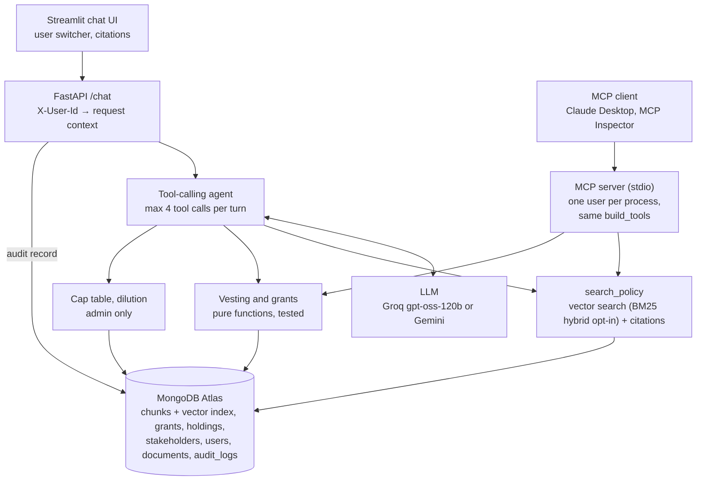

# Vestwise: RAG + tool-calling ESOP assistant

Vestwise answers employees' and admins' questions about stock options. **Every number comes from a tested function, every policy claim cites a page, and every user sees only their own data.**

## The problem

Employees ask HR the same questions about their stock options: *How many have I vested? What happens if I resign? How long do I have to exercise?* The answers live in two places: policy PDFs (rules) and the cap table (numbers). A general-purpose chatbot is the wrong tool for both:

- **Numbers must be exact.** LLMs are unreliable at date arithmetic and rounding, and an equity figure that's off by one month's vesting is a real problem.
- **Claims must be traceable.** "Your unvested options lapse" needs a citation a reviewer can check in seconds.
- **Data must be isolated.** An employee must never see a colleague's grant, however the question is phrased.

Vestwise splits the work: **deterministic tools** compute every number, **retrieval with page-level citations** answers policy questions, and an **LLM only decides which to use and phrases the result**.

## Demo

> _Demo GIF placeholder: `docs/demo.gif` (to be recorded: Priya asks the mixed question and sees the number, citations and tools used; asks for Rahul's grant and is refused; Arjun runs a dilution scenario)._

| As Priya (employee) | Answer |
| --- | --- |
| *If I leave next month, how many options do I keep and how long do I have to exercise them?* | 2,200 vested options (from `get_vesting_status(as_of=2026-11-03)`), 90 days after the last working day [ESOP Policy, p. 5, 6] |
| *Show me Rahul's grant.* | "I can only share information about your own grants." (no tool called, nothing retrieved) |

| As Arjun (admin) | Answer |
| --- | --- |
| *If we issue 2,000,000 new shares to Horizon Capital, how does my ownership change?* | Fully diluted 57.14% → 48.00% (from `simulate_dilution`) |

## Architecture



The API sets identity and writes the audit log. The LLM only chooses which tool to call and writes the answer. On the chat path, the tools are the only components that read cap table data. (The admin-only compliance check reads the pool size through the same repo; see [Grant compliance checker](#grant-compliance-checker).)

**One request** (*"If I leave next month…"* as Priya):

1. The UI sends `POST /chat` with `X-User-Id: u_priya`.
2. The API loads her `company_id`, role and `stakeholder_id` from Mongo into a frozen request context.
3. The agent gets her three tools, each a closure over that context: `search_policy(query)`, `get_vesting_status(as_of)` and `get_grants()`.
4. The model calls `get_vesting_status(as_of="2026-11-03")` (2,200 vested) and `search_policy("exercise window after leaving, termination of employment")` (policy pp. 5–6).
5. It writes the answer from the tool outputs. Every in-text citation is checked against the pages actually retrieved.
6. The API writes an audit record and returns `{answer, outcome, citations, tool_calls, latency_ms}` with an `X-Audit-Id` header.

## Design decisions

| Decision | Why |
| --- | --- |
| **Deterministic tools for every number** | Vesting (`app/tools/vesting.py`) and dilution (`app/tools/captable.py`) are pure, unit-tested functions; the prompt forbids the LLM from calculating. Equity numbers must be exact and auditable, and a pure function can be tested for every edge case (cliff day, month-end grants, leavers). |
| **Tools scoped by closures, not parameters** | Tools are built per request as closures over the server-side context. An employee's `get_vesting_status` takes only `as_of`; there is no `stakeholder_id` parameter for a prompt injection to fill in. Admin-only tools simply don't exist in an employee's request. |
| **Document-level access in the vector filter** | Each chunk carries `company_id` and `owner_stakeholder_id` (null for company-wide documents). The access filter is applied *inside* `$vectorSearch` (a pre-filter), so another employee's grant letter is never a candidate, and the user still gets the best 5 chunks they're allowed to see. |
| **Citation validation** | Every in-text `[Title, p. N]` is checked against the pages retrieved in that turn. An invalid one triggers one corrective retry, then it is stripped and the turn is flagged `citation_invalid` in the audit log. Answers show only citations backed by retrieved text. |
| **Fail-closed audit log** | Every authenticated `/chat` writes a record: who, role, `as_of`, model, tool calls with arguments, retrieved chunk ids, answer, outcome, citation check, latency. Compliance checks and MCP tool calls write records of the same shape (`kind`). If the audit write fails, the answer is not returned. |
| **Temperature 0** | A fixed constant for both providers, for repeatable tool choices and wording. It narrows variation but doesn't remove it (see Evaluation), which is why numbers come from tools and checks accept equivalent forms of the same figure. |
| Heading-aware chunks sized to the embedding model | Chunks split on clause headings, never span two pages (so a citation is exactly one page), and fit `all-MiniLM-L6-v2`'s 256-token window. |
| **Hybrid search measured, kept opt-in** | BM25 + reciprocal rank fusion is built (`RETRIEVAL_MODE=hybrid`) and applies the same access filter as the vector search, but it gave no gain on the golden set (10/11 both ways), so the default stays vector-only. See [Hybrid search](#hybrid-search-measured-not-adopted). |
| **Conversation memory: last 6 messages** | The agent sees the last 6 messages so "And in March next year?" works. The prompt says earlier answers only explain what a follow-up means: any new figure needs a new tool call, never a reused number. |
| Identity only from a header | Request bodies have no identity fields (unknown fields are ignored). For the demo the header is trusted; in production it becomes a verified JWT and only one function changes. |

## Grant compliance checker

An admin uploads a draft grant letter (`POST /compliance/check`, or the **Review grant letter** tab), and Vestwise flags every term that contradicts the ESOP policy or the cap table, citing both documents. **The LLM reads; code decides.**

```text
letter PDF ─▶ extract terms (LLM, structured output, page + quote per field)
          ─▶ ground (code: each quote must be on the page the model named)
          ─▶ compare field by field against reviewed policy rules + cap table (code, no LLM)
          ─▶ report (LLM rephrases each finding; code validates it and adds status, citations, pool source)
```

- **Four outcomes per field, computed in code:** `match`, `conflict`, `missing` (the letter is silent), `not_covered` (no policy rule), plus `exceeds_pool` when the grant is larger than the unallocated ESOP pool. The same letter always gets the same findings.
- **Rules are human-reviewed before they can decide anything.** One LLM pass over the policy and board resolution proposes `data/policy_rules.json`; a person checks every rule against its page; `scripts/build_policy_rules.py --load` refuses a file that isn't marked reviewed. **The review caught 5 of 9 proposed rules citing the wrong page** (each one page too high, from clause 5.1 on). All quotes, fields and values were right, but every report would have cited the wrong page.
- **Data checks use the same rule engine.** `options ≤ $pool_remaining` (989,950, from the cap table) and `grant_date ≥ $board_resolution_date` (15 Nov 2024) are rules whose values are filled in at check time.
- **The report can only rephrase.** One line per finding id; the validator rejects missing, extra or repeated findings, numbers not in the finding, and any pool line that attributes the pool figure to the policy. Status labels, both citations and "(unallocated pool, from the cap table)" are added by code. On any failure the report falls back to a plain template.
- **Every check is audit-logged** (`kind: compliance_check`, findings, rule ids, file hash, LLM calls).

**Result on the three test letters** (`python scripts/check_letters.py`):

| Letter | Planted issues | Findings |
| --- | --- | --- |
| Ananya (clean) | none | 10/10 match |
| Vikram | 6-month cliff, 30-day exercise window | 2 conflicts, e.g. *cliff is 6 months [Draft Grant Letter: Vikram Nair, p. 1] but the policy requires 12 months [ESOP Policy, p. 3, clause 4.2]* |
| Neha | no exercise window, 1,200,000 options | 1 missing, 1 exceeds pool (989,950 left) |

**Precision 1.00, recall 1.00** over the 4 planted issues: all 4 flagged with citations to both the letter and the policy, nothing else flagged. Each LLM report passed validation on the first try.

**The demo makes 0 LLM calls.** Every live output (extractions, reports, the rules proposal) is cached in `data/compliance_cache/`, keyed on the PDF's SHA-256 and the prompt version. Re-checking the test letters through the API takes about 150 ms. A new or edited letter costs two calls: one extraction, one report.

## Evaluation

All numbers below were measured on the synthetic company in `data/`, with `as_of` fixed per question.

| What | Result | How it was measured |
| --- | --- | --- |
| Retrieval hit@5 | **10/11** (91%; target ≥ 90%), vector and hybrid alike | `scripts/eval_retrieval.py [--mode vector\|hybrid]`: each policy and mixed golden question used as the query, as its own user; the expected page must be in the top 5. The one miss is explained below. |
| Isolation | **0 leaks** | Every golden question retrieved as Priya at k=5 and k=50 returns no chunk of Rahul's letter, in both modes; the same probe as admin does return it (positive control). BM25 separately: Priya's per-request keyword corpus holds 0 of Rahul's chunks, and 3 keyword probes aimed at his letter plus all 20 golden questions never rank one. Plus 43 API access tests (401/403 matrix, spoofed identity in body) and the MCP server tests. |
| Follow-up question | **Pass** (1 live run, 4 model calls) | `scripts/try_followup.py` as Priya: "How many options have I vested?" (2,100), then "And in March next year?" → `get_vesting_status(as_of="2027-03-03")` → 2,600, matching the tool. |
| Agent demo set | **10/10** in a single run (Groq `openai/gpt-oss-120b`) | `scripts/try_agent.py`: 3 success-criteria questions, the Rahul probes, dilution, the acquisition question and 3 not-in-documents questions, each with automatic checks. First-draft citation precision 6/6 in that run. |
| Grant compliance checker | **Precision 1.00, recall 1.00** (4 planted issues, 3 letters) | `scripts/check_letters.py`; a planted issue counts only with the expected status and citations to both documents. See [Grant compliance checker](#grant-compliance-checker). |
| Unit and integration tests | **445 passed** | `pytest`; no test calls the LLM or the database (fakes plus a network tripwire; the compliance integration tests replay recorded extractions). |
| Full golden-set eval (20 questions through the agent) | _pending_ | `scripts/eval.py`; see the note below. |

**Full golden-set eval: pending.** `scripts/eval.py` runs all 20 golden questions through the real agent and reports retrieval hit@5, number accuracy, refusal accuracy, citation rate, first-draft citation precision, retry rate, and latency with and without rate-limit waits. One full run uses ~110–135k tokens, and Groq's free tier allows 200k tokens per day for this model, so the two runs needed for a variance measurement are scheduled on separate days. Results will be added here with the run files in `eval/`.

**The one retrieval miss (G07).** "What happens to my options if *Nimbus* gets acquired?" retrieves the acquisition clause (policy p. 7) only at rank 11 with vectors: the company name pulls the query toward the preamble chunks. Hybrid search does **not** fix it (rank 6, still a miss; details below). Through the agent it is fixed end to end by query rewriting: the `search_policy` docstring tells the model to use the policy's vocabulary and drop the company name. The queries the model actually wrote in Phase 5 ("change of control acquisition", "exercise options acquisition change of control") put p. 7 at **rank 1** in both modes at the 0.35 threshold, and the agent cites p. 7 with the 50% acceleration.

### Hybrid search: measured, not adopted

BM25 keyword search (`rank_bm25`) over the chunks, merged with the vector results by reciprocal rank fusion (k = 60). Measured with `scripts/eval_retrieval.py` (no LLM):

| | Vector only | Hybrid (BM25 + RRF) |
| --- | --- | --- |
| hit@5, no threshold | 10/11 | 10/11 |
| hit@5 at min_score 0.35 (production path) | 10/11 | 10/11 |
| G07: rank of policy p. 7 | 11 (miss) | 6 (miss) |
| Other rank changes | | G05 2 → 1 (better), G13 4 → 5, G15 1 → 3 (worse) |
| Not-found gate (3 not-found / 6 off-topic refused at 0.35) | 0/3, 6/6 | 0/3, 6/6 (same gate) |
| Access assertions | PASS | PASS (vector and BM25) |

BM25 does find G07's clause: it ranks it **first** (the stem "acquir" is rare, so it scores high). But vectors rank it 11th, and RRF rewards agreement between the two lists, so chunks both lists rank moderately well (the preambles, which also match "Nimbus") stay ahead; p. 7 misses 5th place by 0.0003. With no hit@5 gain, one question better and two worse, the default stays `RETRIEVAL_MODE=vector`; hybrid stays available behind the setting. A golden set of 11 retrieval questions is too small to justify tuning RRF weights on it.

How access control works in hybrid mode: the BM25 corpus is loaded per request with the *same* `build_access_filter` dict as the vector pre-filter and re-checked in Python (a mismatch raises), so another employee's grant letter is never scored, and its words never affect the IDF statistics either.

## MCP server

`mcp_server/server.py` exposes `get_vesting_status`, `get_grants` and `search_policy` over the Model Context Protocol (stdio), so any MCP client (Claude Desktop, the MCP Inspector, another agent) can use them. It uses the official Python SDK; in mcp 2.x, `FastMCP` is called `MCPServer`.

- **One user per server process.** The user comes from `VESTWISE_USER_ID`, resolved once at startup through the same `load_context` as the API. The server refuses to start if the variable is missing or the user is unknown or unusable.
- **Same tools, same rules.** The tools are the agent's own `build_tools(ctx)` closures, so employees get no stakeholder parameter, admins resolve names within their company, and `search_policy` runs with the user's access filter. An extra `stakeholder_id` argument is ignored. No cap table or dilution tools are exposed.
- **Read-only.** Every tool is annotated `readOnlyHint`.
- **Audit-logged, fail closed.** Every `tools/call` (including unknown tools, invalid arguments and failures) writes an `audit_logs` record with `kind: "mcp"`: user, role, tool name, the arguments exactly as sent (so an ignored `stakeholder_id` is still visible), outcome (`ok`, `not_found`, `rejected`, `error`), latency and the chunk ids `search_policy` returned. The record is written before the result is returned; if the write fails, the client gets an error instead of the data, the same rule as `/chat`. `GET /audit` and the UI's audit tab list these records next to chat turns.

Try it with the MCP Inspector (Node 18+). The server command goes **before** the options:

```bash
npx @modelcontextprotocol/inspector --cli .venv/bin/python mcp_server/server.py \
    -e VESTWISE_USER_ID=u_priya --method tools/list
npx @modelcontextprotocol/inspector --cli .venv/bin/python mcp_server/server.py \
    -e VESTWISE_USER_ID=u_priya --method tools/call --tool-name get_vesting_status --tool-arg as_of=2027-03-01
npx @modelcontextprotocol/inspector .venv/bin/python mcp_server/server.py -e VESTWISE_USER_ID=u_priya   # web UI
```

Claude Desktop (`claude_desktop_config.json`; use absolute paths, since Claude Desktop picks the working directory; `.env` is found from the script's location):

```json
{
  "mcpServers": {
    "vestwise-priya": {
      "command": "/absolute/path/to/vestwise/.venv/bin/python",
      "args": ["/absolute/path/to/vestwise/mcp_server/server.py"],
      "env": { "VESTWISE_USER_ID": "u_priya" }
    }
  }
}
```

Add a second entry (for example `vestwise-arjun` with `u_arjun`) to act as another user; each entry is its own process with its own fixed identity.

## Known limitations

- **Free-tier latency.** On Groq's free tier, answers take 1–30 s, mostly waiting on per-minute token limits (each call sends ~2–3k tokens). Measured without throttling, a two-tool answer takes ~2.5 s, inside the 6 s target. The daily token limit also caps full evaluation runs at about one per day.
- **Citation checks verify retrieval, not entailment.** A citation is accepted if its page was retrieved in that turn; nothing yet checks that the page actually *supports* the sentence it's attached to.
- **Vesting model gaps.** Bad-leaver forfeiture, acceleration on acquisition, unpaid-leave suspension and the 10-year expiry are stated in the policy (and answered from it, with citations), but not modelled in the vesting calculation.
- **Simulated login.** The UI's user switcher sets `X-User-Id`; anyone who can reach the UI can pick the admin. Both servers bind to localhost only. The MCP server likewise trusts whoever sets `VESTWISE_USER_ID` (the local machine's user).
- **Conversation history is client-supplied.** The last 6 messages come from the client, so a user could put words in an "assistant" message. That can't widen access (tools are scoped server-side, and numbers must come from tool calls), but history isn't stored or verified server-side.
- **Synthetic data, one company.** The data model is multi-tenant (`company_id` everywhere), but the demo has one company and four documents.
- **Compliance scores come from a small test set.** Precision and recall are over 4 planted issues in 3 synthetic letters with a clean table layout; messier real letters would need more test cases. The rules cover 10 fields; anything else in a letter isn't checked.

## Setup and run

Requirements: Python 3.12, a MongoDB Atlas cluster (the free M0 tier works, with Atlas Vector Search), and a Groq or Gemini API key.

```bash
git clone <this repo> && cd vestwise
python3.12 -m venv .venv && source .venv/bin/activate
pip install -r requirements.txt
cp .env.example .env            # fill in MONGO_URI, LLM_PROVIDER, LLM_MODEL and the provider's API key

python scripts/build_pdfs.py            # synthetic policy, grant letters, board resolution
python scripts/seed.py                  # company, users, stakeholders, holdings, grants
python scripts/ingest_all.py            # chunk + embed the PDFs into Atlas
python scripts/create_vector_index.py   # Atlas Vector Search index (waits until READY)

python scripts/build_policy_rules.py --load   # load the reviewed compliance rules

python -m pytest -q                     # 445 tests, no network
bash scripts/run_all.sh                 # API on :8000/docs, UI on :8501; Ctrl+C stops both
```

Demo users: `u_priya` and `u_rahul` (employees), `u_arjun` (admin). Other scripts:

| Script | Purpose |
| --- | --- |
| `scripts/api_demo.sh` | The demo questions with curl, plus access checks and the last audit records |
| `scripts/try_agent.py` | 10 agent cases with pass/fail checks |
| `scripts/eval_retrieval.py` | Retrieval hit@5, score distribution, access assertions incl. BM25 (no LLM); `--mode vector\|hybrid` |
| `scripts/try_followup.py` | Live two-turn follow-up check as Priya (at most 4 model calls, 30 s apart) |
| `scripts/eval.py` | Full golden-set evaluation through the agent; `--compare` for run-to-run variance |
| `scripts/build_policy_rules.py` | Propose compliance rules with one LLM pass (cached); `--load` loads the reviewed file |
| `scripts/check_letters.py` | Check the 3 test letters and print precision/recall; `--plan` shows how many live LLM calls a run would make |

## Project layout

```text
app/
  main.py, schemas.py        FastAPI endpoints and models (identity from X-User-Id)
  context.py                 RequestContext, loaded server-side
  agent.py                   tool-calling loop, citation validation, answer normalisation
  audit.py                   audit records
  llm.py, config.py, db.py   provider switch (temperature 0), settings, Mongo handles
  ingest/                    PDF loader, heading-aware chunker, embedder, pipeline
  rag/                       access filter, retriever (vector; BM25 + RRF hybrid opt-in), system prompt
  tools/                     vesting, cap table/dilution (pure), repo, per-request tool factory
  compliance/                grant letter schema, extraction + grounding, rule engine, report validation, cache
ui/                          Streamlit app and its HTTP client
mcp_server/server.py         MCP server (stdio): the same tools for one fixed user, every call audit-logged
data/policy_rules.json       human-reviewed compliance rules
data/compliance_cache/       recorded LLM outputs (extractions, reports, rules proposal)
scripts/                     data build, seed, ingest, index, demos, evals
eval/golden.jsonl            20 golden questions
tests/                       pytest suite
```

## What's next

- **Ground policy rules in code:** check each proposed rule's quote against the PDF and correct its page automatically, as letter extraction already does; that would have caught all 5 wrong pages before review.
- **Entailment check for citations:** an LLM judge (or an NLI model) that verifies each cited sentence is supported by the cited page, not just that the page was retrieved.
- **A bigger retrieval golden set,** several phrasings per fact, before tuning hybrid search further (RRF weights, company-name handling); 11 questions can't tell a real gain from noise.
- **Real auth:** OIDC login with a verified JWT in place of the `X-User-Id` header; for MCP, the streamable HTTP transport with OAuth, so the identity comes from a token per request instead of a fixed environment variable.
- Server-side conversation persistence and streaming answers.
